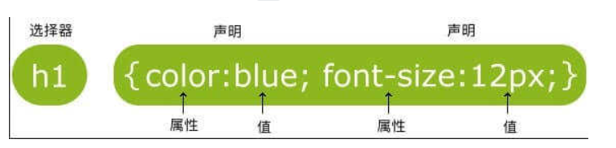
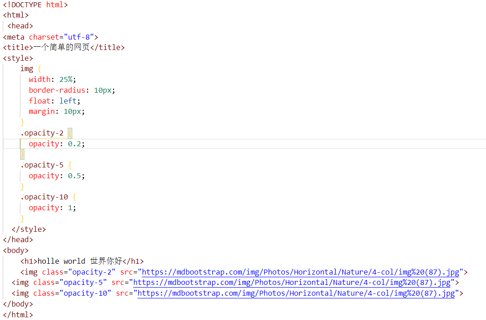

# css学习总结

### 一、css简介

+  > HTML是用来撰写网页页面的内容，但是将所有的修饰性内容都写在HTML文件中这样会很不好管理，所以就有了css的出现。css就是将所有的样式内容写在一个css文件之中，在通过引用的方式得以展现，大大提高了代码的复用率，提高了整体开发的效率。

### 二、css语法
+ > 一条css样式规则主要的两个部分分别是：选择器，以{}包裹的一条或多条声明;
+ 具体形式如下：
 

+ > 

css有三种方法可以定义，分别是：外部样试表，内部样式表，内联样式。可以根据不同情况的需要而进行选择其中的一种放法进行对HTML元素的控制。

### 三、对css初步学习之后的简单认识

+ >css相当于就是一种对HTML的那些作为修饰HTML元素以及网页界面的内容的一种归纳。有了css之后，使用者就可以在使用HTML将网页页面设计出来之后通过引用的方法从专门存放css语句的文件中将其引用到HTML的具体元素上面去。通过这一方法就大大增强了开发的效率，同时也是大大增加了代码的从用铝。同时，在后期对页面进行修改的时候也可以减去很多不必要的麻烦。总之，在有了css的帮助下下，使用HTML设计页面时会大大提高效率。
  
### 四、一个简单css具体例子
+ **实例代码**
 

+ **实例图**

> 这是一个关于不同明度的演示。还有其他很多的样式，例如：颜色、尺寸、对齐，盒子模型，边框与边距，定位等等。